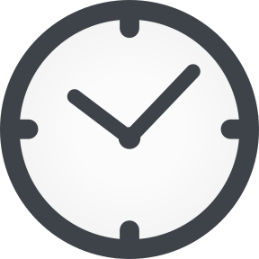
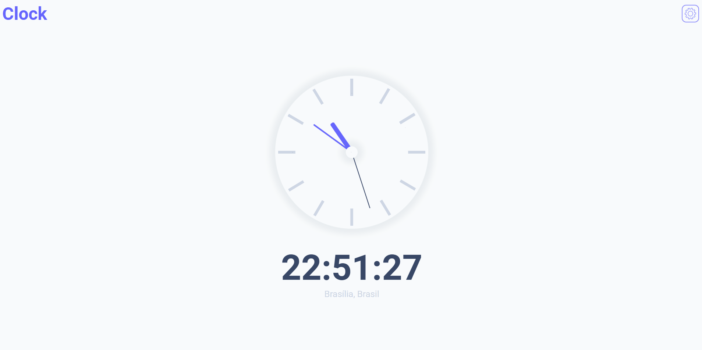

# Clock 

<h4 align="center">
  🚧 Projeto Clock e ReadMe 🚀 Em Construção 🚧
</h4>

## Sobre

Um aplicativo de relógio, com horário de algumas regiões já definido. O aplicativo foi construído em cima das bibliotecas:
  - [Momentjs](https://momentjs.com/) utilizada para configuração de Data e Hora; e
  - [Momentjs Timezone](https://momentjs.com/timezone/) utilizada como base dos horários padrões das regiões mundiais.

Esse projeto teve inicio com a junção de um simples projeto de relógio e a curiosidade de utilizar as bibliotecas acima citadas. 

### `Versão 01`

Nessa primeira versão é encontrado como interação apenas a alteração dos horários pré-definidos.

<h1 align="center">
  
</h1>

### `Itens que foram ou serão adicionados`

- [x] Usuário escolher o horário de uma região pré-definida
- [ ] Fazer a versão responsiva para mobile
- [ ] Deixar o usuário escolher qualquer região
- [ ] Adicionar o tema Dark
- [ ] Criação de funções úteis no dia a dia (Como cronômetro, pomodoro e despertador)

#

  Feito com 💜 por Lucas David 👋  
  Aproveitando que tal dar uma olhadinha no meu <a target="_blank" href="https://www.linkedin.com/in/lucasdav/">LinkedIn</a> 🌠

